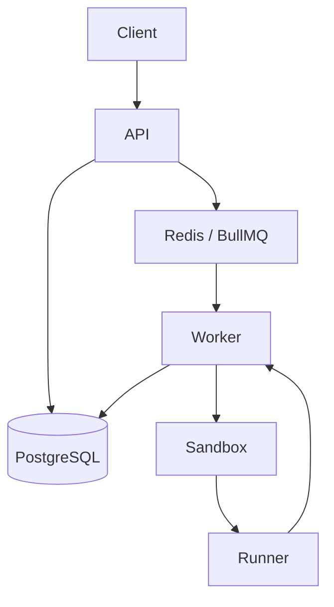

# edtronaut-live-code-engine

Asynchronous code execution backend built with NestJS, PostgreSQL, Redis, BullMQ, and Docker-based language sandboxes.

## Quick Start

```bash
docker compose up --build
```

In a second terminal, start the worker:

```bash
npm install
npm run build
npm run build:sandbox
npm run start:worker
```

The API will be available at `http://localhost:3000`.

## 1. Project Overview

`edtronaut-live-code-engine` is a backend service for live coding workflows where code execution must be asynchronous, traceable, and isolated from the request-response path.

Primary use cases:

- coding playgrounds
- interview platforms
- education products
- internal tools that need queued code execution

Core goals:

- persist code sessions and execution history
- enqueue execution requests without blocking the API
- process executions in a dedicated worker
- run user code inside short-lived Docker containers
- support multiple languages through a shared sandbox abstraction

## 2. System Architecture

The system is split into API, persistence, queue, worker, and sandbox layers.



Execution path:

```text
POST /code-sessions/:sessionId/run
  -> create executions row with status QUEUED
  -> enqueue BullMQ job
  -> worker picks job
  -> worker loads execution + session
  -> worker calls SandboxService
  -> SandboxService picks a language runner
  -> runner executes code in Docker
  -> worker writes final result to PostgreSQL
```

Component roles:

- `API Server`: validates input, persists sessions, creates execution records, enqueues jobs
- `PostgreSQL`: stores sessions, executions, and execution metadata
- `Redis / BullMQ`: queues execution jobs between API and worker
- `Worker`: orchestrates execution lifecycle out of band
- `SandboxService`: selects the correct runtime implementation by language
- `SandboxRunner`: per-language execution adapter
- `DockerRunnerService`: shared low-level container execution helper

## 3. Project Structure

```text
.
├── docker/
│   └── sandbox/
│       ├── node/
│       │   └── Dockerfile
│       └── python/
│           └── Dockerfile
├── src/
│   ├── infrastructure/
│   │   ├── database/
│   │   ├── queue/
│   │   └── redis/
│   ├── modules/
│   │   ├── code-sessions/
│   │   └── executions/
│   ├── sandbox/
│   │   ├── docker/
│   │   ├── runners/
│   │   ├── sandbox.module.ts
│   │   ├── sandbox.service.ts
│   │   └── sandbox.types.ts
│   ├── shared/
│   │   └── config/
│   ├── workers/
│   │   └── code-execution.worker.ts
│   ├── app.module.ts
│   └── main.ts
├── docker-compose.yml
├── Dockerfile
├── package.json
└── .env.example
```

## 4. Docker Setup (Recommended)

The recommended local workflow is Docker-first for infrastructure and app startup.

Start the stack:

```bash
docker compose up --build
```

This starts:

- `app`
- `postgres`
- `redis`

Current limitation:

- the worker is not yet included in `docker-compose.yml`
- executions will stay in `QUEUED` until a worker process is started separately

Start the worker in another terminal:

```bash
npm install
npm run build
npm run build:sandbox
npm run start:worker
```

Expected startup signals:

- Postgres: `database system is ready to accept connections`
- Redis: `Ready to accept connections tcp`
- App: `Nest application successfully started`

Stop the stack:

```bash
docker compose down
```

## 5. Local Setup (Non-Docker API Workflow)

Use this workflow if you want to run the API process directly on the host.

### Prerequisites

- Node.js 20+
- npm
- Docker Desktop or Docker Engine

### Environment variables

Create `.env` from `.env.example`:

```bash
cp .env.example .env
```

Local defaults:

```env
PORT=3000

DATABASE_HOST=localhost
DATABASE_PORT=5432
DATABASE_USERNAME=postgres
DATABASE_PASSWORD=postgres
DATABASE_NAME=edtronaut_live_code_engine

REDIS_HOST=localhost
REDIS_PORT=6379
```

### Start dependencies

```bash
docker compose up -d postgres redis
```

### Install and run

```bash
npm install
npm run build
npm run build:sandbox
npm run start:dev
```

Start the worker in a second terminal:

```bash
npm run start:worker
```

## 6. Docker Networking

Inside Docker Compose, containers do not use `localhost` to reach each other. In a container, `localhost` points back to that same container, not to Postgres or Redis.

That is why the app container uses:

- `DATABASE_HOST=postgres`
- `REDIS_HOST=redis`

Docker Compose provides internal DNS for service names, so `postgres` resolves to the Postgres container and `redis` resolves to the Redis container on the same Compose network.

## 7. API Documentation

Base URL:

```text
http://localhost:3000
```

### POST /code-sessions

Create a new code session.

Request:

```http
POST /code-sessions
Content-Type: application/json
```

```json
{
  "language": "python"
}
```

Response:

```json
{
  "id": "15486c46-ba9f-4255-bd63-09578cbbaa5a",
  "language": "python",
  "sourceCode": "",
  "status": "ACTIVE",
  "createdAt": "2026-03-17T09:15:37.522Z",
  "updatedAt": "2026-03-17T09:15:37.522Z"
}
```

### PATCH /code-sessions/:sessionId

Update language and/or source code for an existing session.

Request:

```http
PATCH /code-sessions/:sessionId
Content-Type: application/json
```

```json
{
  "sourceCode": "print(\"hello docker test\")"
}
```

Response:

```json
{
  "id": "b2bafd38-7670-4424-954a-79542b21622d",
  "language": "python",
  "sourceCode": "print(\"hello docker test\")",
  "status": "ACTIVE",
  "createdAt": "2026-03-17T09:15:50.796Z",
  "updatedAt": "2026-03-17T09:15:50.838Z"
}
```

### POST /code-sessions/:sessionId/run

Create an execution record and enqueue the execution job.

Request:

```http
POST /code-sessions/:sessionId/run
```

Response:

```json
{
  "executionId": "c898ec06-8a3e-45e3-872f-b2ed110403ad",
  "status": "QUEUED"
}
```

### GET /executions/:executionId

Get the current execution state and result.

Response after worker completion:

```json
{
  "id": "c898ec06-8a3e-45e3-872f-b2ed110403ad",
  "sessionId": "b2bafd38-7670-4424-954a-79542b21622d",
  "status": "COMPLETED",
  "stdout": "hello docker test\n",
  "stderr": null,
  "executionTimeMs": 491,
  "exitCode": 0,
  "queuedAt": "2026-03-17T09:15:50.849Z",
  "startedAt": "2026-03-17T09:16:53.377Z",
  "finishedAt": "2026-03-17T09:16:54.058Z",
  "retryCount": 0,
  "events": [],
  "createdAt": "2026-03-17T09:15:50.850Z",
  "updatedAt": "2026-03-17T09:16:54.062Z"
}
```

If the worker is not running, the execution will remain in `QUEUED`.

## 8. Execution Flow

Execution lifecycle:

```text
QUEUED -> RUNNING -> COMPLETED
                 \-> FAILED
```

Detailed flow:

1. API receives `POST /code-sessions/:sessionId/run`
2. API loads the session
3. API creates an `Execution` record with `status = QUEUED`
4. API enqueues BullMQ job `run-code`
5. Worker receives the job
6. Worker marks execution as `RUNNING`
7. Worker loads the latest session source
8. Worker calls `SandboxService.runCode(language, sourceCode)`
9. Sandbox executes the code inside a language-specific container
10. Worker updates `stdout`, `stderr`, `exitCode`, `executionTimeMs`, and final status

## 9. Autosave Behavior

The editor should not send an API request on every keystroke. Doing so would create excessive `PATCH /code-sessions/:sessionId` traffic, unnecessary database writes, and noisy queue-triggering behavior around active editing.

The expected strategy is debounced autosave: the client waits for a short idle window, typically `300-500ms`, after the user stops typing before sending the latest `sourceCode`.

Because the API persists the latest source into PostgreSQL, `POST /code-sessions/:sessionId/run` always executes the most recently saved code. This keeps execution consistent with the editor state while reducing server load and improving UX.

Future improvements may include diff-based updates or collaborative editing models such as CRDTs.

## 10. Queue & Worker Design

Why use a queue:

- execution should not block HTTP requests
- API response should stay fast even for expensive runs
- the request path stays small and predictable
- retry and scaling strategies become easier later

Why a separate worker process:

- isolates execution orchestration from the API server
- keeps sandbox startup cost off the request path
- allows API and worker to scale independently
- provides a clean boundary for future sandbox hardening

Queue details:

- queue name: `code-execution`
- job name: `run-code`
- job payload:

```json
{
  "executionId": "uuid"
}
```

## 11. Sandbox Design

The sandbox layer is no longer mock-based. Each execution is run inside a short-lived Docker container selected by language.

Design:

```text
Worker
  -> SandboxService
      -> SandboxRunner interface
          -> PythonRunner
          -> JavascriptRunner
          -> TypescriptRunner
              -> DockerRunnerService
                  -> docker run
```

Execution model:

- the worker loads the session source code
- the runner creates a temporary working directory
- the source file is written to that directory
- the directory is bind-mounted read-only into `/workspace`
- a fresh container is started for the execution
- stdout, stderr, exit code, and execution time are captured
- the container is removed after the run
- the temp directory is deleted after cleanup

Security and isolation controls currently applied:

- `--rm`
- `--network none`
- `--read-only`
- `--cap-drop ALL`
- `--security-opt no-new-privileges=true`
- tmpfs mounts for `/tmp` and `/run`
- CPU limits
- memory limits
- `pids-limit`

Language support currently implemented:

- Python via `edtronaut-python-runner`
- JavaScript via `edtronaut-node-runner`
- TypeScript via `edtronaut-node-runner` + `tsx`

This keeps the worker language-agnostic and makes it straightforward to add runners for Go, Java, or C++ later.

## 12. Sandbox Limitations

Current sandbox limitations:

- each execution pays a cold-start container cost
- containers are not reused or pooled
- dependencies are not cached per project or session
- no support yet for long-running interactive jobs
- no package installation workflow inside executions
- no compilation pipeline yet for heavier compiled languages

These are acceptable trade-offs for the current phase, where correctness and isolation are more important than execution throughput.

## 13. Idempotency and Duplicate Execution Handling

The current system accepts every `run` request as a new execution. That is fine for an early phase, but it leaves room for duplicate runs caused by retries, double-clicks, or client reconnect behavior.

A production design should add explicit duplicate handling, for example:

- an idempotency key supplied by the client
- or a derived execution fingerprint such as `hash(sessionId + sourceCode + language)`

That would make it possible to reject or reuse equivalent executions while keeping queue behavior predictable.

## 14. Scaling Strategy

The architecture is designed so API and worker capacity can scale independently.

- API instances scale based on HTTP traffic
- worker instances scale based on queue depth and execution throughput
- Redis acts as the broker between the two
- PostgreSQL remains the source of truth for execution state

This is the main benefit of the `API -> Queue -> Worker -> Sandbox` split: request handling and execution capacity do not need to scale together.

## 15. Assumptions

Current assumptions:

- one worker instance is sufficient for local development
- executions are short-lived batch runs, not interactive sessions
- clients poll `GET /executions/:executionId` for result retrieval
- Redis and PostgreSQL are available through Docker Compose
- local Docker is trusted and available to the worker host

## 16. Trade-offs

Current trade-offs are intentional:

- worker is still started separately from Docker Compose
- database schema currently relies on TypeORM `synchronize` in development
- no dead-letter queue or advanced retry policy
- no rate limiting or abuse controls
- no multi-tenant resource scheduling
- no persistent execution artifact storage

## 17. Future Improvements

Likely next steps:

- add worker as a Compose service for full Docker-first local startup
- move from `synchronize` to migrations
- add execution timeout enforcement at queue and runner levels
- persist `execution_events` during lifecycle transitions
- add dead-letter handling and retries
- add worker autoscaling rules
- add container pooling and warm runtime strategies
- add package-install or dependency-cache flows for supported languages
- add streaming output or websocket-based execution updates
- add observability and execution metrics

## 18. Development Notes

Recommended workflow is now Docker-first.

Option A, Docker-first API:

```bash
docker compose up --build
```

Then start the worker separately:

```bash
npm install
npm run build
npm run build:sandbox
npm run start:worker
```

Option B, host-run API:

```bash
docker compose up -d postgres redis
npm install
npm run build
npm run build:sandbox
npm run start:dev
```

Then start the worker:

```bash
npm run start:worker
```

Important behavior:

- the worker is a separate process
- if the worker is not running, executions stay in `QUEUED`
- app container uses `DATABASE_HOST=postgres` and `REDIS_HOST=redis`
- sandbox images must exist before the worker can execute code:

```bash
npm run build:sandbox
```

The worker can run either:

- locally on the host
- or in a future containerized worker service
